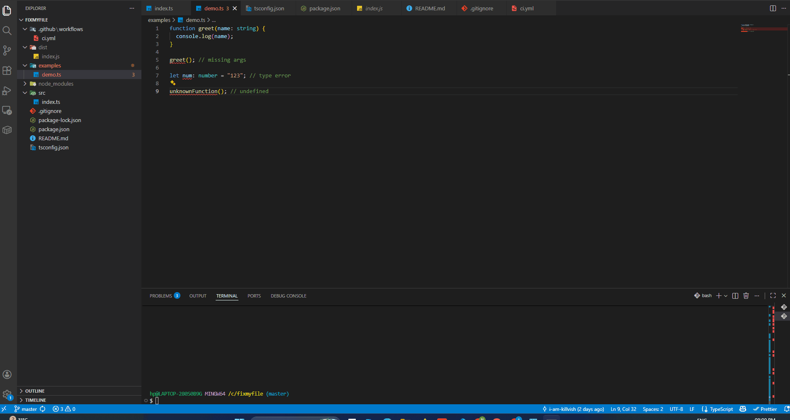

# fixmyfile 🚀

### ⚡ Demo



Fix recurring TypeScript workflow friction automatically.

---

## ✨ What it does

`fixmyfile` detects common TypeScript friction points and applies automatic fixes using compiler diagnostics and AST transformations.

It focuses on repetitive issues that slow developers down during everyday TypeScript development.

---

## ⚡ Example

### ❌ Before

```ts
const values = [1, 2, undefined, 4].filter(Boolean);

const doubled = values.map((v) => v * 2);
```

TypeScript may still complain that:

```txt
'v' is possibly 'undefined'
```

### ✅ After

```ts
const values = [1, 2, undefined, 4].filter((x): x is NonNullable<typeof x> =>
  Boolean(x),
);

const doubled = values.map((v) => v * 2);
```

---

## ✨ Current Fixes

- Fix missing function arguments (`TS2554`)
- Fix simple type mismatches (`TS2322`)
- Handle undefined symbol errors (`TS2304`)
- Improve `.filter(Boolean)` type narrowing automatically
- Add optional chaining for possibly undefined access (`TS18048`)

---

## 🖥 Usage

```bash
fixmyfile <file>
```

## 📁 Examples

See the `examples/` folder for sample files and transformations.

---

## 📦 Installation

```bash
npm install -g fixmyfile
```

---

## 📁 Examples

See the `examples/` folder for sample files.

---

## 🚧 Scope

`fixmyfile` currently focuses on:

- common TypeScript workflow friction
- repetitive compiler issues
- safe AST-based transformations
- single-file automatic fixes

The project intentionally prioritizes predictable and reliable transformations over aggressive code mutation.

---

## 🤝 Contributing

Contributions, issue reports, and TypeScript pain-point discussions are welcome.

Please open an issue before major changes.

---

## 🚧 Future Improvements

This project is actively evolving with improvements planned around performance, accuracy, and broader TypeScript support.

---

## 📄 License

MIT

## 🔗 Repository

https://github.com/i-am-killvish/fixmyfile
